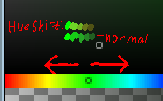

Most of the text rendering we see today is anti-aliased. Anti-aliasing helps text appear smoother and takes advantage of the same effect that allows us to not see pixels on our screens. This effect breaks down when zooming in, and can cause text to appear blurry.

When creating pixel art, or pixel-art like art, it's important to use aliased fonts, as our work is often scaled beyond its normal resolution.

(insert example of zoomed antialiased text)

When chosing colors, I like to follow this sort of technique i learned from Jappa 

>   
>
> [...] *For more interesting colors you should shift the hue everytime you go darker, you can go either left or right, whatever feels better. I'd also add some noise with slightly brighter and hue shifted single pixels spread out and maybe some dark spots*  
>
>From [@JasperBoerstra on Twitter](https://twitter.com/JasperBoerstra/status/1100740951662886913) [Archive Link](https://web.archive.org/web/20231224213730/https://twitter.com/JasperBoerstra/status/1100740951662886913?s=20)