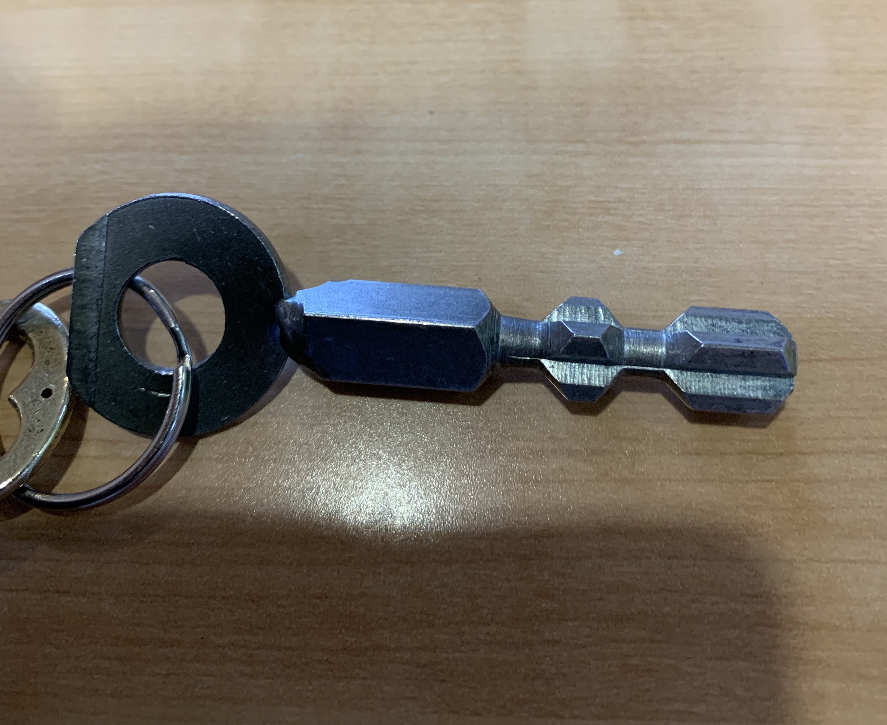
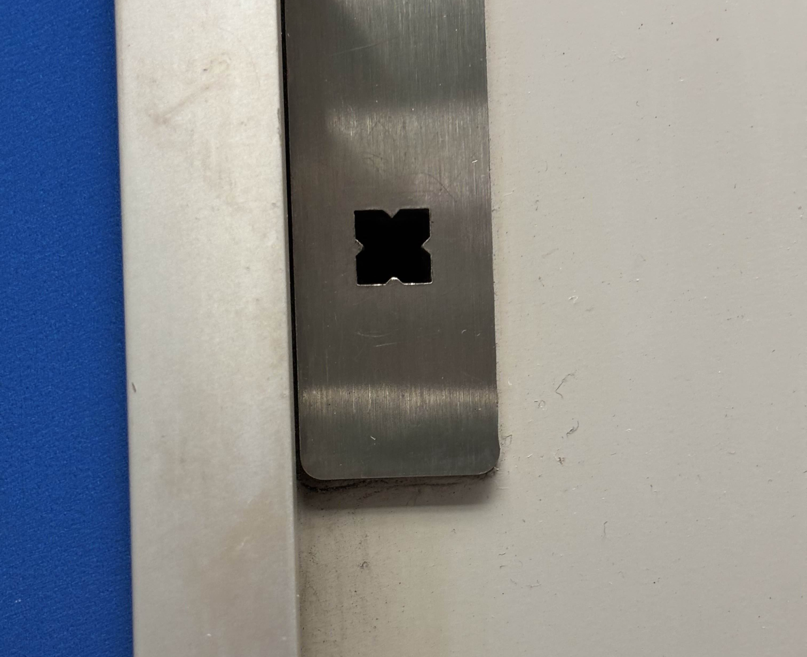
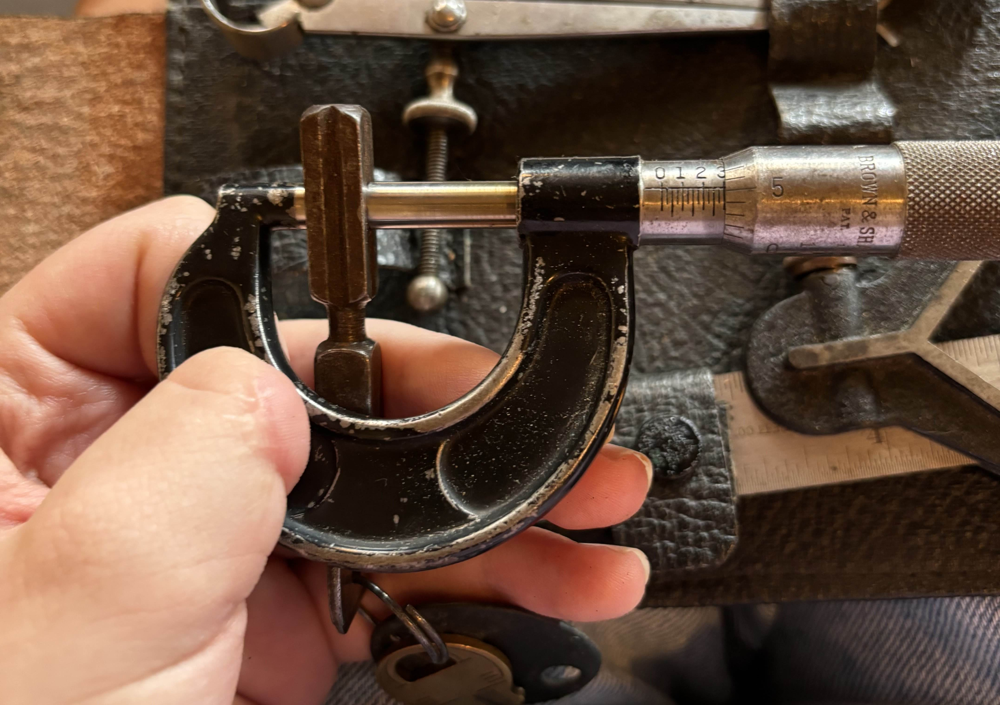
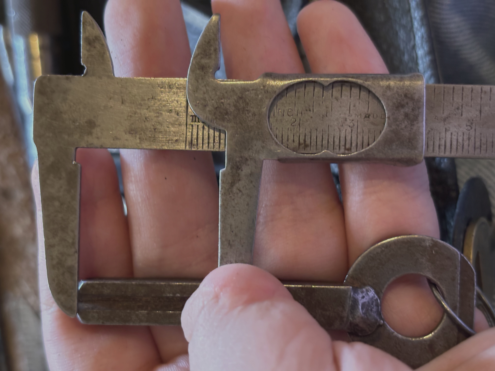
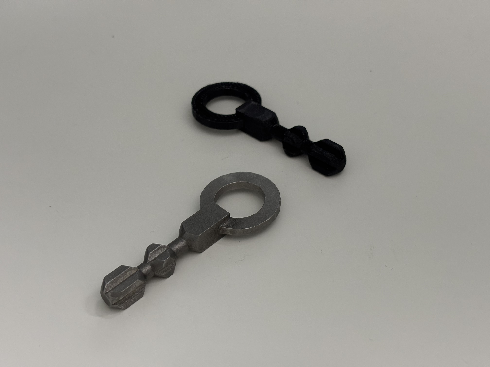

I'm not entirely sure of my motivation behind this, but I decided I wanted one.

**Please don't do anything stupid with this information. I made these as a novelty and do not plan to use them without permission.**

The Toronto Transit Commission and GO Transit seem to both share a utility key. Measuring the socket it's a 8 mm square hole with little wings to prevent any old piece of square bar from fitting. The TTC employees call it the "Cab Key"; probably because it also opens the operator's cab.

I got lucky and the local train museum happened to have one and allowed me to measure it.

I made each "layer" to scale in [Inkscape](https://inkscape.org/) and imported those SVGs into [Tinkercad](https://www.tinkercad.com/) and extruded them. I then exported a triangle and used the SVG revolve tool to cut bevels at the borders of each layer. Then I added a loop for a key ring.

Initial tests were 3D printed in PLA and after confirming fitment I sent the model to be 3D printed in metal. Each key ended up costing about C$15 at [JLC3DP](https://jlc3dp.com/) (not sponsored) and I printed 3 extra to give to friends.

